# GitLab: Build Stage, Test Stage, Deployment Types & Branching Strategy — Real-World Guide

## Big Picture — GitLab Role in the Full Pipeline

```
Developer writes code
        ↓
Git Push / Merge Request
        ↓
GitLab detects branch/trigger
        ↓
.gitlab-ci.yml pipeline starts
        ↓
  ┌─────────────────────────┐
  │  BUILD STAGE            │  ← Compile, package, validate
  │  TEST STAGE             │  ← Unit, integration, coverage
  │  SONARQUBE              │  ← Static analysis
  │  DOCKER BUILD + SCAN    │  ← Image creation + security
  │  ARTIFACTORY PUSH       │  ← Artifact storage
  └─────────────────────────┘
        ↓
  CD Pipeline (deploy to environments)
```

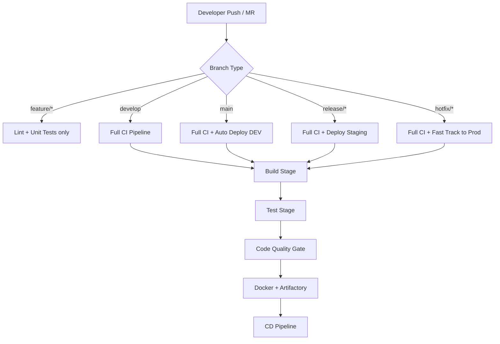

---

## PART 1 — GitLab Build Stage: Everything That Happens

### What the Build Stage Does

```
Source Code (raw .java / .py / .ts files)
        ↓
1. Dependency Resolution       → Download libraries from Nexus/Artifactory/npm
2. Code Generation             → Generate DTOs, Swagger clients, JAXB classes
3. Compilation                 → .java → .class → .jar / .war
4. Static Resource Processing  → Bundle CSS/JS, minify assets
5. Packaging                   → Assemble final artifact (.jar / .war / .zip)
6. Archive Artifact            → Upload to GitLab artifact store for next stages
```

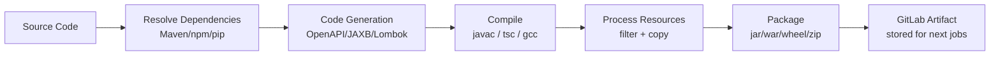

### Complete Build Stage `.gitlab-ci.yml`

```yaml
# ── BUILD STAGE ──────────────────────────────────────────────────
variables:
  MAVEN_OPTS: "-Dmaven.repo.local=$CI_PROJECT_DIR/.m2/repository
               -Dmaven.artifact.threads=8
               -XX:+TieredCompilation -XX:TieredStopAtLevel=1"
  MAVEN_CLI_OPTS: "--batch-mode --errors --fail-at-end
                   --no-transfer-progress -DinstallAtEnd=true"

# Cache Maven dependencies between pipelines (speeds up build)
cache:
  key:
    files:
      - pom.xml                          # Cache invalidated when pom.xml changes
  paths:
    - .m2/repository/
  policy: pull-push

build:
  stage: build
  image: maven:3.9-eclipse-temurin-17
  script:
    # Step 1: Validate project structure
    - mvn $MAVEN_CLI_OPTS validate

    # Step 2: Download all dependencies (fail fast if unavailable)
    - mvn $MAVEN_CLI_OPTS dependency:resolve

    # Step 3: Check for known vulnerable dependencies (OWASP)
    - mvn $MAVEN_CLI_OPTS org.owasp:dependency-check-maven:check
        -DfailBuildOnCVSS=9
        -DsuppressionFile=owasp-suppressions.xml

    # Step 4: Compile source + generate code
    - mvn $MAVEN_CLI_OPTS compile

    # Step 5: Package (skip tests — tests run in next stage)
    - mvn $MAVEN_CLI_OPTS package -DskipTests

    # Step 6: Print artifact info
    - ls -lh target/*.jar
    - echo "Build artifact: $(ls target/*.jar)"

  artifacts:
    name: "$CI_PROJECT_NAME-$CI_COMMIT_SHORT_SHA"
    paths:
      - target/*.jar
      - target/*.war
    expire_in: 1 day                     # Keep 24h for downstream stages
  rules:
    - if: '$CI_PIPELINE_SOURCE == "merge_request_event"'
    - if: '$CI_COMMIT_BRANCH =~ /^(main|develop|release\/.*)$/'
```

### Build Stage Internals — What Each Tool Does

| Tool | Language | Build Command | Artifact |
|---|---|---|---|
| Maven | Java | `mvn package` | `target/*.jar` |
| Gradle | Java/Kotlin | `./gradlew build` | `build/libs/*.jar` |
| npm / Webpack | Node.js | `npm run build` | `dist/` |
| pip / Poetry | Python | `poetry build` | `dist/*.whl` |
| Go build | Go | `go build ./...` | `./app` binary |
| dotnet publish | C# | `dotnet publish` | `publish/` |
| Cargo | Rust | `cargo build --release` | `target/release/app` |

### Dependency Caching Strategy

```yaml
# Per-branch cache (fastest, independent)
cache:
  key: "$CI_COMMIT_REF_SLUG"
  paths: [.m2/repository/]

# Per-pom.xml hash (invalidates only when deps change — recommended)
cache:
  key:
    files: [pom.xml]
  paths: [.m2/repository/]

# Shared global cache (risky — concurrent write conflicts)
cache:
  key: "global-maven-cache"
  paths: [.m2/repository/]
  policy: pull           # read-only on feature branches
```

---

## PART 2 — GitLab Test Stage: Everything That Happens

### Testing Pyramid in CI

```
                    ▲
                   /E2E\           ← Few, slow, expensive
                  /─────\            (Selenium, Cypress, Playwright)
                 /  INT  \         ← Medium, external deps
                /─────────\          (Spring Boot Test, Testcontainers)
               /   UNIT    \      ← Many, fast, isolated
              /─────────────\       (JUnit, Mockito, pytest)
             └───────────────┘
```

### Complete Test Stage Configuration

```yaml
# ── UNIT TEST STAGE ──────────────────────────────────────────────
unit-test:
  stage: test
  image: maven:3.9-eclipse-temurin-17
  dependencies:
    - build                              # Pull compiled artifact
  script:
    # Run unit tests with JaCoCo coverage
    - mvn $MAVEN_CLI_OPTS test
        jacoco:report
        -Dtest="**/*Test,**/*Spec"
        -DfailIfNoTests=false

    # Print test summary
    - |
      echo "=== TEST SUMMARY ==="
      grep -E "Tests run:|BUILD" target/surefire-reports/*.txt || true

  coverage: '/Total.*?([0-9]{1,3})%/'  # Parse coverage from output for GitLab badge

  artifacts:
    when: always                         # Upload even if tests fail
    reports:
      junit: target/surefire-reports/TEST-*.xml        # GitLab Test tab
      coverage_report:
        coverage_format: cobertura
        path: target/site/jacoco/jacoco.xml            # GitLab Coverage tab
    paths:
      - target/surefire-reports/
      - target/site/jacoco/
    expire_in: 1 week

# ── INTEGRATION TEST STAGE ───────────────────────────────────────
integration-test:
  stage: test
  image: maven:3.9-eclipse-temurin-17
  services:
    - name: postgres:15-alpine           # Spin up real DB for integration tests
      alias: postgres
      variables:
        POSTGRES_DB: testdb
        POSTGRES_USER: testuser
        POSTGRES_PASSWORD: testpass
    - name: redis:7-alpine
      alias: redis
  variables:
    SPRING_DATASOURCE_URL: "jdbc:postgresql://postgres:5432/testdb"
    SPRING_DATASOURCE_USERNAME: testuser
    SPRING_DATASOURCE_PASSWORD: testpass
    SPRING_REDIS_HOST: redis
  script:
    - mvn $MAVEN_CLI_OPTS verify
        -Pintegration-tests
        -DskipUnitTests=true
        failsafe:report

  artifacts:
    when: always
    reports:
      junit: target/failsafe-reports/TEST-*.xml
    paths:
      - target/failsafe-reports/
    expire_in: 1 week

# ── CODE QUALITY CHECKS ──────────────────────────────────────────
lint-and-style:
  stage: test
  image: maven:3.9-eclipse-temurin-17
  script:
    # Checkstyle — enforce coding standards
    - mvn $MAVEN_CLI_OPTS checkstyle:check
        -Dcheckstyle.config.location=checkstyle.xml
        -Dcheckstyle.failOnViolation=true

    # SpotBugs — static bug finder
    - mvn $MAVEN_CLI_OPTS spotbugs:check

    # PMD — source code analyzer
    - mvn $MAVEN_CLI_OPTS pmd:check
  artifacts:
    when: always
    paths:
      - target/checkstyle-result.xml
      - target/spotbugsXml.xml
      - target/pmd.xml
    expire_in: 1 week
  allow_failure: false

# ── PARALLEL TESTING (faster pipelines) ─────────────────────────
# Split tests across multiple runners simultaneously
test-parallel-1:
  stage: test
  script:
    - mvn test -Dtest="com/example/service/**/*Test"
  parallel: 3                            # Run 3 instances in parallel
```

### What GitLab Does With Test Results

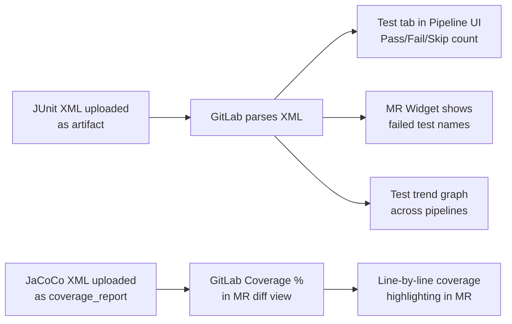

### Types of Tests Run in CI

| Test Type | Tool | When Runs | Speed | Blocks Pipeline |
|---|---|---|---|---|
| Unit Tests | JUnit + Mockito | Every push | Fast (< 2 min) | Yes |
| Integration Tests | JUnit + Testcontainers | Every push to develop/main | Medium (5-10 min) | Yes |
| Contract Tests | Pact | Every push | Fast | Yes |
| API Tests | Postman/Newman, RestAssured | Post-deploy QA | Medium | Yes |
| End-to-End Tests | Selenium, Cypress, Playwright | Staging only | Slow (20-60 min) | Yes |
| Performance Tests | k6, JMeter, Gatling | Staging only | Slow | Optional |
| Security Tests | OWASP ZAP, Nikto | Staging/Prod | Medium | Optional |
| Mutation Tests | PIT Mutation | Scheduled/weekly | Very slow | No |

---

## PART 3 — GitLab Branching Strategies (Real-World)

### Strategy 1: GitFlow (Enterprise / Regulated Industries)

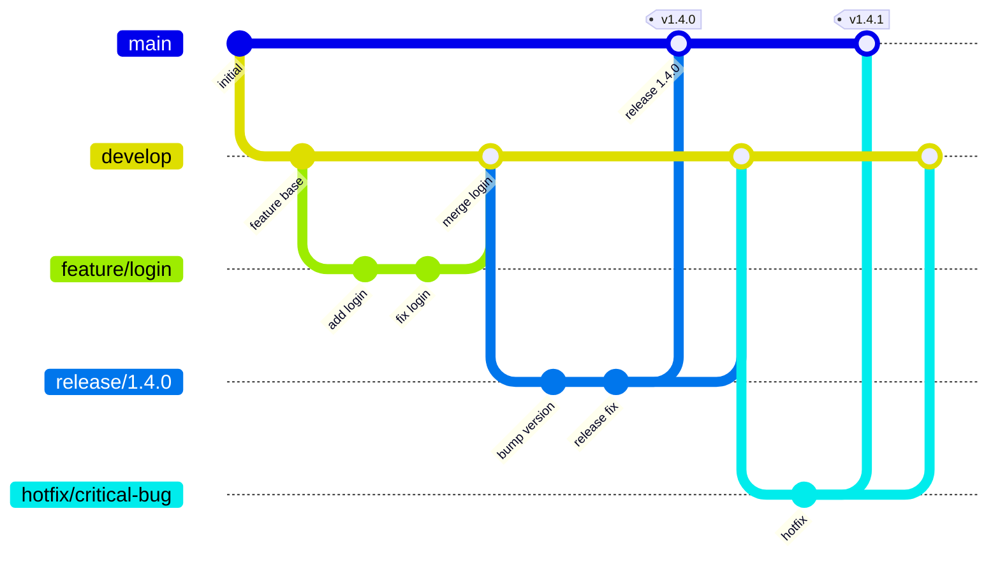

```
Branches:
  main        → Production code only. Tagged releases.
  develop     → Integration branch. All features merge here first.
  feature/*   → One branch per feature/ticket (JIRA-123-add-login)
  release/*   → Stabilization before production (bug fixes only)
  hotfix/*    → Emergency production fixes (bypasses develop)

CI Rules:
  feature/*   → lint + unit tests (fast feedback)
  develop     → full CI (unit + integration + sonar)
  release/*   → full CI + deploy to staging
  main        → full CI + deploy to production (after approval)
  hotfix/*    → full CI + fast-track to production
```

### Strategy 2: GitHub Flow (Simplified / Startups / SaaS)

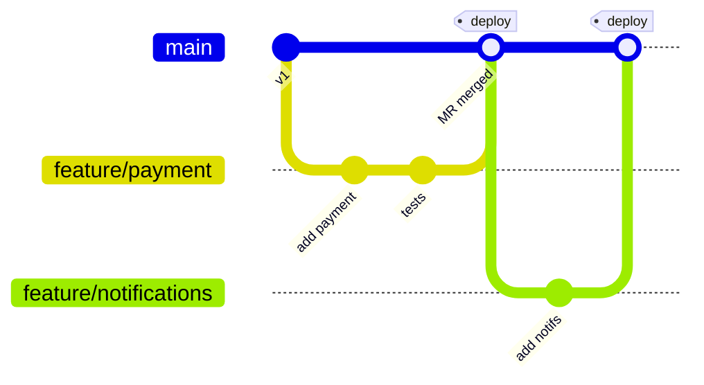

```
Branches:
  main        → Always deployable. Every merge triggers deploy.
  feature/*   → Short-lived. Merged via MR with review.

CI Rules:
  feature/*   → full CI on every push (MR pipeline)
  main        → full CI + auto deploy to production

Best for: Teams deploying many times per day (SaaS products)
```

### Strategy 3: Trunk-Based Development (High-Performance Teams)

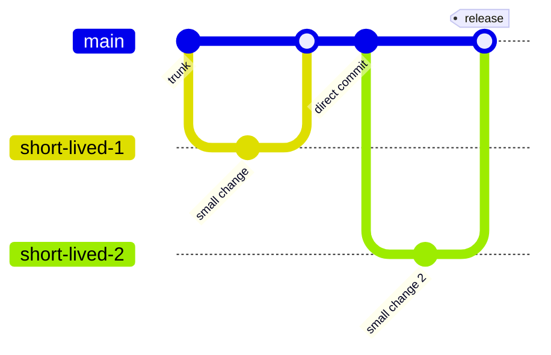

```
Branches:
  main (trunk) → Everyone commits here. Branches live < 1 day.
  release/v*   → Cut from main at release time (no long-lived branches)

Rules:
  - Feature flags hide incomplete features in production
  - Every commit to main triggers full CI + deploy to dev
  - Very high test coverage required (> 90%)

Best for: Google/Meta style continuous deployment
```

### Strategy 4: Environment Branching (Traditional Enterprise)

```
branch          → environment    → pipeline
─────────────────────────────────────────────
feature/*       → (no deploy)    → CI only
develop         → DEV            → auto deploy
qa              → QA             → auto deploy
staging         → STAGING        → auto deploy
main            → PRODUCTION     → manual approval
```

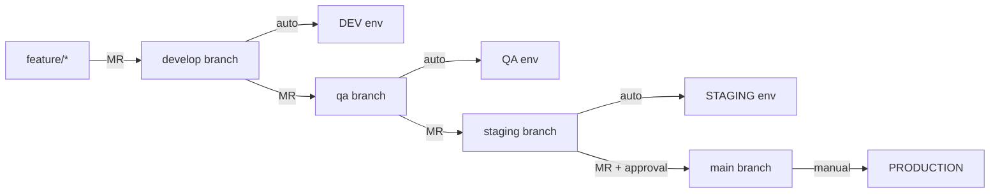

### Branch Protection Rules in GitLab (Mandatory Setup)

```yaml
# Settings > Repository > Protected Branches

Branch: main
  - Allowed to push:        No one (only via MR)
  - Allowed to merge:       Maintainers
  - Require approvals:      2
  - MR must pass CI:        Yes (required)
  - Code owner approval:    Yes
  - No force push:          Enabled

Branch: develop
  - Allowed to push:        Developers
  - Allowed to merge:       Developers + Maintainers
  - Require approvals:      1
  - MR must pass CI:        Yes

Branch: release/*
  - Allowed to push:        No one
  - Allowed to merge:       Maintainers only
  - Require approvals:      2
```

---

## PART 4 — Deployment Types: How Each Works End-to-End

### Deployment Type 1: Rolling Update (Default Kubernetes)

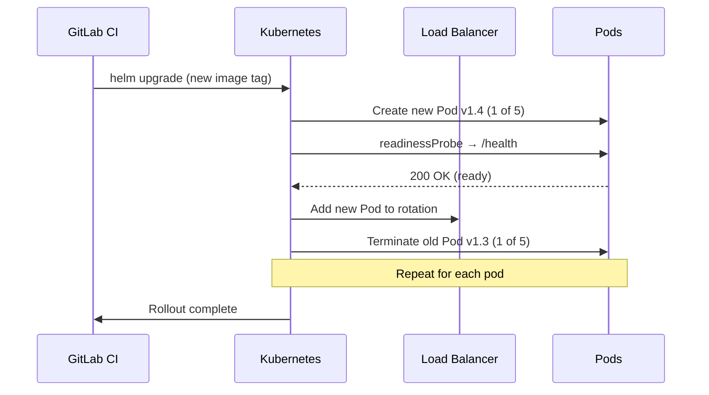

```yaml
# Deployment spec
strategy:
  type: RollingUpdate
  rollingUpdate:
    maxSurge: 1          # Create 1 extra pod before removing old
    maxUnavailable: 0    # Never go below desired replica count

# Timeline for 5 replicas:
# t=0:  [v1.3, v1.3, v1.3, v1.3, v1.3]  — 5 serving
# t=30: [v1.4, v1.3, v1.3, v1.3, v1.3]  — 5 serving (1 updated)
# t=60: [v1.4, v1.4, v1.3, v1.3, v1.3]  — 5 serving
# t=90: [v1.4, v1.4, v1.4, v1.4, v1.4]  — 5 serving — DONE
```

**When to use:** Standard deployments, non-critical applications
**Rollback time:** 2-5 minutes (`helm rollback` or `kubectl rollout undo`)

---

### Deployment Type 2: Blue/Green (Zero Downtime)

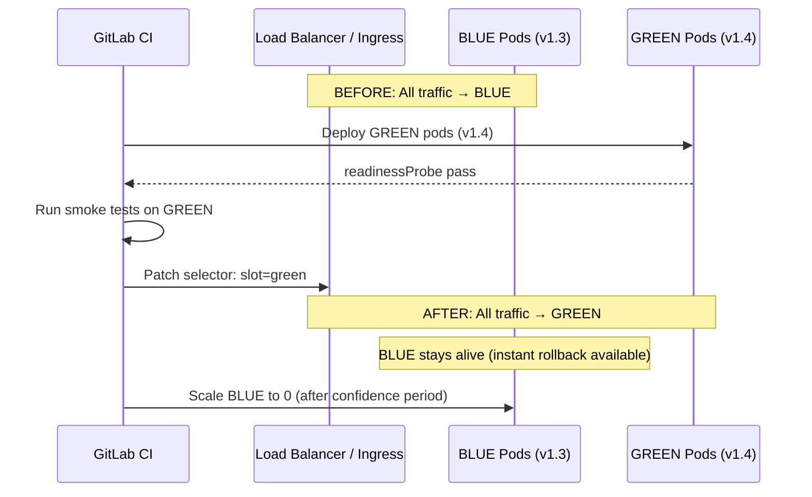

```yaml
# GitLab CI — Blue/Green deploy script
script:
  # Deploy GREEN (new version)
  - helm upgrade --install my-app-green ./helm/my-app
      --set image.tag=$IMAGE_TAG
      --set service.slot=green
      --wait --atomic

  # Test GREEN before switching traffic
  - curl -f http://my-app-green-svc.production/actuator/health

  # Switch load balancer to GREEN
  - kubectl patch ingress my-app-ingress -n production
      -p '{"spec":{"rules":[{"http":{"paths":[{"backend":{"service":{"name":"my-app-green-svc"}}}]}}]}}'

  # Keep BLUE for 30 min rollback window, then clean up
  - echo "GREEN is live. BLUE standby for 30 minutes."

# Rollback: switch back to BLUE instantly
rollback:
  script:
    - kubectl patch ingress my-app-ingress -n production
        -p '{"spec":{"rules":[{"http":{"paths":[{"backend":{"service":{"name":"my-app-blue-svc"}}}]}}]}}'
    - echo "Rolled back to BLUE"
```

**When to use:** Production deployments, zero tolerance for downtime
**Rollback time:** Seconds (one `kubectl patch`)

---

### Deployment Type 3: Canary Release (Risk-Controlled Rollout)

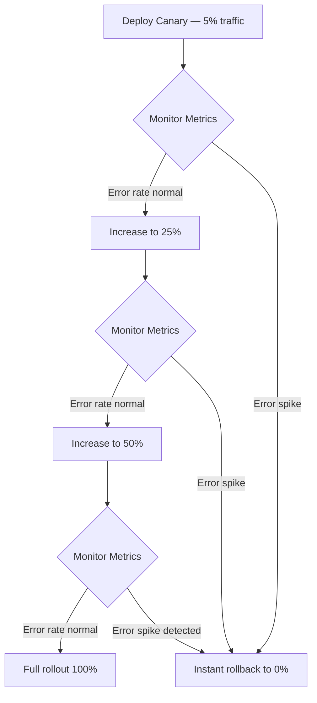

```yaml
# Nginx Ingress canary annotation approach
# Step 1: Deploy canary with 5% traffic weight
- kubectl apply -f - <<EOF
apiVersion: networking.k8s.io/v1
kind: Ingress
metadata:
  name: my-app-canary
  annotations:
    nginx.ingress.kubernetes.io/canary: "true"
    nginx.ingress.kubernetes.io/canary-weight: "5"
spec:
  rules:
    - http:
        paths:
          - backend:
              service:
                name: my-app-canary-svc
                port:
                  number: 8080
EOF

# Step 2: Monitor error rate for 10 minutes
- sleep 600

# Step 3: Check error rate via metrics API
- |
  ERROR_RATE=$(curl -s "http://prometheus:9090/api/v1/query?
    query=rate(http_requests_total{status=~'5..'}[5m])" \
    | jq '.data.result[0].value[1]')
  if (( $(echo "$ERROR_RATE > 0.01" | bc -l) )); then
    # Rollback — remove canary
    kubectl delete ingress my-app-canary
    exit 1
  fi

# Step 4: Increase to 50% then 100%
- kubectl annotate ingress my-app-canary
    nginx.ingress.kubernetes.io/canary-weight=50 --overwrite
```

**When to use:** High-risk features, new architecture, A/B testing
**Rollback time:** Instant (delete canary ingress)

---

### Deployment Type 4: Recreate (Simple, With Downtime)

```
Old pods KILLED first → New pods STARTED
(~30-60 seconds of downtime)

When to use:
  - Databases with schema migration (can't run 2 versions simultaneously)
  - Jobs/workers (not web-facing)
  - Dev/test environments where downtime is acceptable
```

```yaml
strategy:
  type: Recreate     # Kubernetes kills all old pods, then creates new ones
```

---

### Deployment Type 5: Feature Flags (Code Deploy ≠ Feature Release)

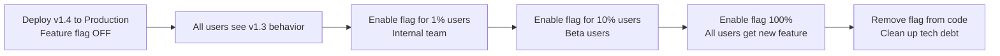

```java
// Code example — feature flag in application
@GetMapping("/checkout")
public ResponseEntity<?> checkout() {
    if (featureFlagService.isEnabled("new-payment-flow", currentUser)) {
        return newPaymentFlowService.process();   // v1.4 feature
    }
    return legacyCheckoutService.process();       // v1.3 behavior
}
```

```yaml
# GitLab Feature Flags (built-in)
# Settings > Deployments > Feature Flags

Feature: new-payment-flow
Strategy: gradual-rollout
Rollout: 10%               # Start at 10% of users
Environment: production
```

**When to use:** Decoupling deploy from release, A/B testing, dark launches
**Rollback time:** Toggle flag off — instant, no redeploy needed

---

### Deployment Type 6: Shadow / Dark Deployment

```
Real traffic → v1.3 (live, users see this)
      ↓ mirrored
Shadow traffic → v1.4 (running but responses discarded)

Purpose: Test v1.4 under real production load without users seeing it
```

```yaml
# Istio traffic mirroring
apiVersion: networking.istio.io/v1alpha3
kind: VirtualService
metadata:
  name: my-app
spec:
  http:
    - route:
        - destination:
            host: my-app-v1
            port:
              number: 8080
          weight: 100
      mirror:
        host: my-app-v2                  # Shadow traffic to v2
        port:
          number: 8080
      mirrorPercentage:
        value: 100.0                     # Mirror 100% of traffic
```

---

## PART 5 — How GitLab CI/CD Variables Work in Build/Deploy

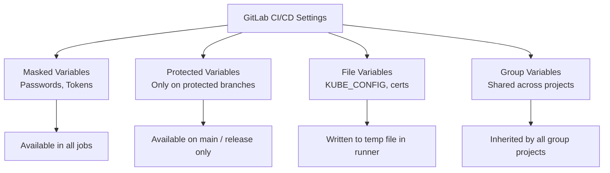

### Predefined GitLab CI Variables Used in Real Pipelines

| Variable | Value Example | Used For |
|---|---|---|
| `$CI_COMMIT_SHA` | `a3f5c2d1b8e4f7a2...` | Full commit hash for image labels |
| `$CI_COMMIT_SHORT_SHA` | `a3f5c2d1` | Docker image tag |
| `$CI_COMMIT_REF_NAME` | `main`, `feature/login` | Branch name |
| `$CI_COMMIT_REF_SLUG` | `feature-login` | URL-safe branch name |
| `$CI_COMMIT_TAG` | `v1.4.2` | Semantic version for releases |
| `$CI_PIPELINE_ID` | `12345` | JFrog Build Number |
| `$CI_PROJECT_NAME` | `my-app` | Image name |
| `$CI_PROJECT_PATH_SLUG` | `org-my-app` | SonarQube project key |
| `$CI_PROJECT_URL` | `https://gitlab.com/org/my-app` | OCI image source label |
| `$CI_MERGE_REQUEST_IID` | `42` | SonarQube PR analysis |
| `$CI_ENVIRONMENT_NAME` | `production` | Environment-specific config |
| `$CI_JOB_TOKEN` | auto-generated | Clone other GitLab repos in CI |
| `$CI_REGISTRY_IMAGE` | `registry.gitlab.com/org/app` | GitLab internal registry |

---

## PART 6 — GitLab MR (Merge Request) Pipeline Features

### What GitLab Shows in Every MR

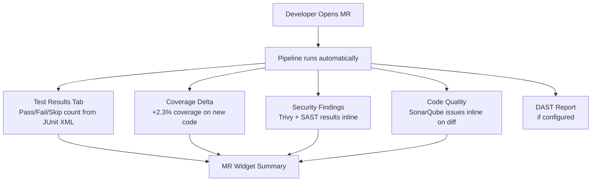

### MR Pipeline Configuration

```yaml
# Only run full pipeline on MR, fast check on feature branches
workflow:
  rules:
    - if: '$CI_PIPELINE_SOURCE == "merge_request_event"'
      variables:
        PIPELINE_TYPE: "merge_request"
    - if: '$CI_COMMIT_BRANCH == "main"'
      variables:
        PIPELINE_TYPE: "main"
    - if: '$CI_COMMIT_BRANCH =~ /^feature\//'
      variables:
        PIPELINE_TYPE: "feature"

# Conditional job execution based on pipeline type
unit-test:
  rules:
    - when: always          # Always run unit tests

integration-test:
  rules:
    - if: '$PIPELINE_TYPE == "merge_request"'    # Only on MR
    - if: '$PIPELINE_TYPE == "main"'             # And on main

deploy-dev:
  rules:
    - if: '$PIPELINE_TYPE == "main"'             # Only deploy from main
```

---

## PART 7 — Full `.gitlab-ci.yml` Combining Everything

```yaml
# ════════════════════════════════════════════════════════════════
# Complete Real-World Pipeline
# ════════════════════════════════════════════════════════════════

stages:
  - validate
  - build
  - test
  - security
  - package
  - publish
  - deploy-dev
  - deploy-qa
  - deploy-staging
  - production-gate
  - deploy-production

# ── Global Variables ─────────────────────────────────────────────
variables:
  # Build
  MAVEN_OPTS: "-Dmaven.repo.local=$CI_PROJECT_DIR/.m2/repository"
  # Image
  IMAGE_NAME: "$CI_PROJECT_NAME"
  IMAGE_TAG: "$CI_COMMIT_SHORT_SHA"
  IMAGE_FULL: "$ARTIFACTORY_URL/docker-dev-local/$IMAGE_NAME:$IMAGE_TAG"
  # Kubernetes
  HELM_CHART: "./helm/$CI_PROJECT_NAME"

# ── Cache ────────────────────────────────────────────────────────
cache:
  key:
    files: [pom.xml]
  paths: [.m2/repository/]

# ── STAGE: Validate ──────────────────────────────────────────────
validate:
  stage: validate
  image: maven:3.9-eclipse-temurin-17
  script:
    - mvn validate                       # Validate pom.xml structure
    - mvn dependency:resolve --quiet     # Ensure all deps resolvable
  rules:
    - if: '$CI_PIPELINE_SOURCE == "merge_request_event"'
    - if: '$CI_COMMIT_BRANCH =~ /^(main|develop|release\/.*)$/'

# ── STAGE: Build ─────────────────────────────────────────────────
build:
  stage: build
  image: maven:3.9-eclipse-temurin-17
  script:
    - mvn package -DskipTests -B
    - echo "Artifact built: $(ls target/*.jar)"
  artifacts:
    paths: [target/*.jar]
    expire_in: 1 day

# ── STAGE: Test (parallel) ───────────────────────────────────────
unit-test:
  stage: test
  image: maven:3.9-eclipse-temurin-17
  script:
    - mvn test jacoco:report -B
  artifacts:
    when: always
    reports:
      junit: target/surefire-reports/TEST-*.xml
      coverage_report:
        coverage_format: cobertura
        path: target/site/jacoco/jacoco.xml
    paths:
      - target/surefire-reports/
      - target/site/jacoco/
  coverage: '/Total.*?([0-9]{1,3})%/'

integration-test:
  stage: test
  image: maven:3.9-eclipse-temurin-17
  services:
    - postgres:15-alpine
    - redis:7-alpine
  script:
    - mvn verify -Pintegration -DskipUnitTests=true -B
  artifacts:
    when: always
    reports:
      junit: target/failsafe-reports/TEST-*.xml
  rules:
    - if: '$CI_PIPELINE_SOURCE == "merge_request_event"'
    - if: '$CI_COMMIT_BRANCH =~ /^(main|develop)$/'

# ── STAGE: Security ──────────────────────────────────────────────
sonarqube:
  stage: security
  image: sonarsource/sonar-scanner-cli:latest
  variables:
    GIT_DEPTH: "0"
  script:
    - sonar-scanner
        -Dsonar.projectKey=$CI_PROJECT_PATH_SLUG
        -Dsonar.host.url=$SONAR_HOST_URL
        -Dsonar.token=$SONAR_TOKEN
        -Dsonar.junit.reportPaths=target/surefire-reports
        -Dsonar.coverage.jacoco.xmlReportPaths=target/site/jacoco/jacoco.xml
        -Dsonar.qualitygate.wait=true

dependency-scan:
  stage: security
  image: maven:3.9-eclipse-temurin-17
  script:
    - mvn org.owasp:dependency-check-maven:check -DfailBuildOnCVSS=7
  artifacts:
    when: always
    paths: [target/dependency-check-report.html]

# ── STAGE: Package (Docker) ──────────────────────────────────────
docker-build:
  stage: package
  image: docker:24
  services: [docker:24-dind]
  variables:
    DOCKER_TLS_CERTDIR: "/certs"
  script:
    - echo "$ARTIFACTORY_PASSWORD" | docker login $ARTIFACTORY_URL
        -u $ARTIFACTORY_USER --password-stdin
    - docker build
        --build-arg GIT_COMMIT=$CI_COMMIT_SHA
        -t $IMAGE_FULL
        -t $ARTIFACTORY_URL/docker-dev-local/$IMAGE_NAME:latest .
    - docker save $IMAGE_FULL > image.tar
  artifacts:
    paths: [image.tar]
    expire_in: 2 hours

trivy-scan:
  stage: package
  image: aquasec/trivy:latest
  needs: [docker-build]
  script:
    - trivy image --exit-code 1 --severity CRITICAL,HIGH $IMAGE_FULL
  artifacts:
    when: always
    reports:
      container_scanning: trivy-report.json

# ── STAGE: Publish ───────────────────────────────────────────────
push-to-artifactory:
  stage: publish
  image: releases-docker.jfrog.io/jfrog/jfrog-cli-v2:latest
  needs: [trivy-scan]
  script:
    - docker load < image.tar
    - docker push $IMAGE_FULL
    - jfrog rt build-collect-env $CI_PROJECT_NAME $CI_PIPELINE_ID
    - jfrog rt build-add-git $CI_PROJECT_NAME $CI_PIPELINE_ID
    - jfrog rt build-publish $CI_PROJECT_NAME $CI_PIPELINE_ID

# ── STAGES: Deploy (DEV → QA → Staging → Prod) ──────────────────
.deploy-template: &deploy-template
  image: dtzar/helm-kubectl:latest
  script:
    - echo "$KUBE_CONFIG" | base64 -d > ~/.kube/config
    - helm upgrade --install $CI_PROJECT_NAME $HELM_CHART
        --namespace $NAMESPACE
        --create-namespace
        --set image.repository=$ARTIFACTORY_URL/docker-dev-local/$IMAGE_NAME
        --set image.tag=$IMAGE_TAG
        --set env=$ENVIRONMENT
        --wait --timeout 10m --atomic

deploy-dev:
  <<: *deploy-template
  stage: deploy-dev
  variables:
    KUBE_CONFIG: $KUBE_CONFIG_DEV
    NAMESPACE: dev
    ENVIRONMENT: development
  environment:
    name: development
    url: https://dev.myapp.company.com
  rules:
    - if: '$CI_COMMIT_BRANCH == "main"'

deploy-production:
  <<: *deploy-template
  stage: deploy-production
  variables:
    KUBE_CONFIG: $KUBE_CONFIG_PROD
    NAMESPACE: production
    ENVIRONMENT: production
  environment:
    name: production
    url: https://myapp.company.com
  when: manual
  rules:
    - if: '$CI_COMMIT_BRANCH == "main"'
```

---

## PART 8 — End-to-End Stage Summary

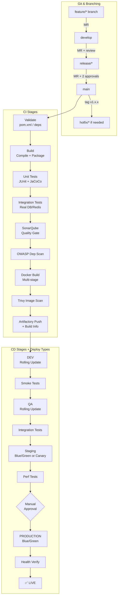

### Complete Checklist

```
GIT & BRANCHING
  [ ] Branch naming convention enforced (feature/, hotfix/, release/)
  [ ] main and develop are protected branches
  [ ] MR requires minimum 1-2 reviewer approvals
  [ ] MR pipeline must pass before merge allowed
  [ ] CODEOWNERS file defined for critical paths

BUILD STAGE
  [ ] Dependency cache configured (per pom.xml hash)
  [ ] Build uses -DskipTests (tests run separately for parallelism)
  [ ] Artifact uploaded with expire_in set
  [ ] OWASP dependency check included
  [ ] Build fails fast — validate stage before heavy build

TEST STAGE
  [ ] Unit tests: JUnit XML uploaded as artifact report
  [ ] Coverage: JaCoCo XML uploaded as coverage_report artifact
  [ ] Integration tests use service containers (real DB, Redis)
  [ ] Tests run in parallel where possible
  [ ] artifacts: when: always (upload even on failure for diagnosis)
  [ ] Code style / linting enforced (Checkstyle / ESLint / Flake8)

DEPLOYMENT TYPE SELECTION
  [ ] DEV/QA: Rolling Update (speed over zero-downtime)
  [ ] Staging: Blue/Green (mirrors production)
  [ ] Production: Blue/Green or Canary (zero downtime + risk control)
  [ ] DB-heavy deploys: Recreate with maintenance window
  [ ] New features: Feature Flags (decouple deploy from release)

GITLAB CI VARIABLES
  [ ] All secrets masked + protected
  [ ] KUBE_CONFIG stored as File type variable
  [ ] No hardcoded values in .gitlab-ci.yml
  [ ] Environment-specific variables scoped to correct environment
  [ ] Group-level variables for shared credentials across projects
```

---

> **Real-World Rule:** Never deploy directly from a feature branch to any environment. Feature branches run CI only. Only `develop`, `release/*`, and `main` should trigger deployments — and production deployments must always require a human approval step.
