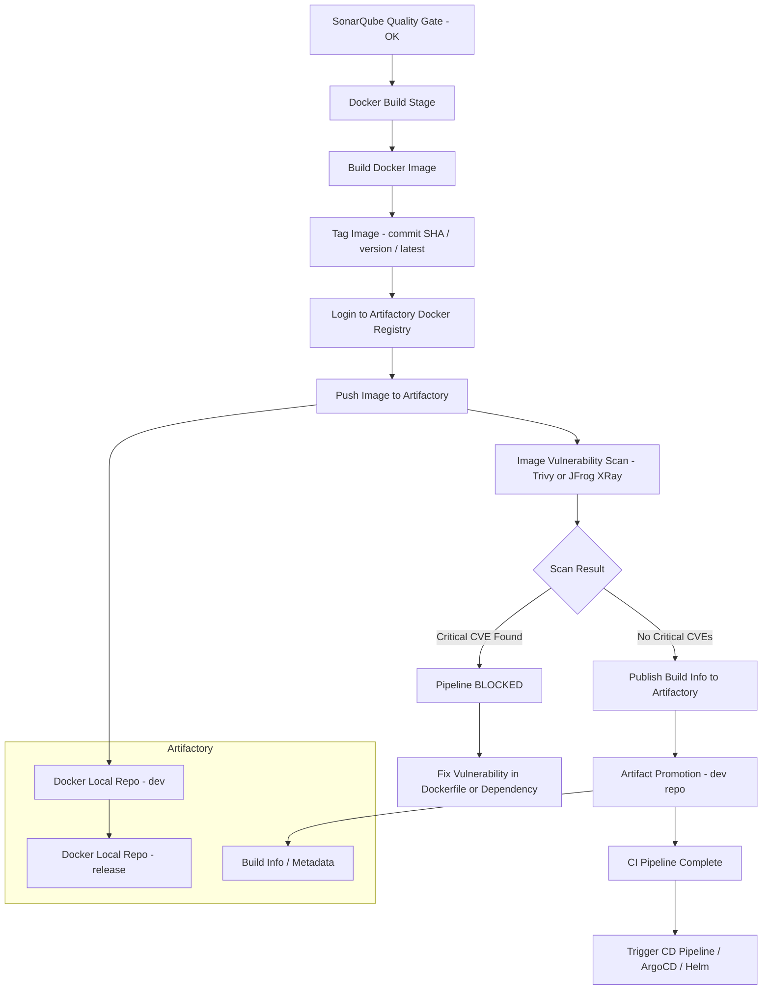
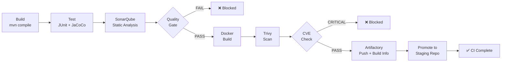

# Post-SonarQube: Docker Build & Artifactory — CI Pipeline Guide

## Flow Overview (CI Only — After SonarQube)

```
SonarQube Quality Gate PASS
        ↓
  Docker Build Stage
        ↓
  Docker Image Tag
        ↓
  Artifactory Push (Docker Registry)
        ↓
  Image Scan (Trivy/XRay)
        ↓
  Publish Build Info to Artifactory
        ↓
  CI Complete ✓ (CD picks up from here)
```



---

## 1. What Happens Immediately After SonarQube

| Step | Tool | Purpose |
|---|---|---|
| Quality Gate result received | SonarQube API | Block or proceed |
| Docker image build | Docker / Buildah | Package the application |
| Image tagging | Docker CLI | Versioning strategy |
| Registry login | Artifactory credentials | Auth to push |
| Image push | Docker push | Store image in Artifactory |
| Image scan | Trivy / JFrog XRay | Security vulnerability scan |
| Build info publish | JFrog CLI | Traceability — link code → artifact |
| Artifact promotion | JFrog CLI | Promote from dev → staging repo |

---

## 2. Complete `.gitlab-ci.yml` — Post-Sonar Stages

```yaml
stages:
  - build
  - test
  - sonarqube-analysis
  - quality-gate
  - docker-build        # ← After Sonar
  - docker-scan         # ← Security scan
  - artifactory-publish # ← Push & register artifact

variables:
  SONAR_HOST_URL: "$SONAR_HOST_URL"
  SONAR_TOKEN: "$SONAR_TOKEN"

  # Artifactory variables (set in GitLab CI/CD Variables)
  ARTIFACTORY_URL: "$ARTIFACTORY_URL"               # e.g. https://company.jfrog.io
  ARTIFACTORY_USER: "$ARTIFACTORY_USER"
  ARTIFACTORY_PASSWORD: "$ARTIFACTORY_PASSWORD"
  ARTIFACTORY_DOCKER_REPO: "docker-dev-local"       # Repo name in Artifactory
  IMAGE_NAME: "my-app"
  IMAGE_TAG: "$CI_COMMIT_SHORT_SHA"                 # Tag with git commit SHA

# ── STAGE 5: Docker Build ────────────────────────────────────────
docker-build:
  stage: docker-build
  image: docker:24
  services:
    - docker:24-dind                                 # Docker-in-Docker
  variables:
    DOCKER_TLS_CERTDIR: "/certs"
  before_script:
    - echo "$ARTIFACTORY_PASSWORD" | docker login
        "$ARTIFACTORY_URL" -u "$ARTIFACTORY_USER" --password-stdin
  script:
    # Build the image
    - docker build
        --build-arg BUILD_DATE=$(date -u +'%Y-%m-%dT%H:%M:%SZ')
        --build-arg GIT_COMMIT=$CI_COMMIT_SHA
        --build-arg GIT_BRANCH=$CI_COMMIT_REF_NAME
        --label "org.opencontainers.image.revision=$CI_COMMIT_SHA"
        --label "org.opencontainers.image.source=$CI_PROJECT_URL"
        -t $ARTIFACTORY_URL/$ARTIFACTORY_DOCKER_REPO/$IMAGE_NAME:$IMAGE_TAG
        -t $ARTIFACTORY_URL/$ARTIFACTORY_DOCKER_REPO/$IMAGE_NAME:latest
        -f Dockerfile .

    # Save image as artifact for scan stage
    - docker save $ARTIFACTORY_URL/$ARTIFACTORY_DOCKER_REPO/$IMAGE_NAME:$IMAGE_TAG
        > image.tar
  artifacts:
    paths:
      - image.tar
    expire_in: 1 hour
  rules:
    - if: '$CI_COMMIT_BRANCH == "main"'
    - if: '$CI_PIPELINE_SOURCE == "merge_request_event"'

# ── STAGE 6: Docker Image Security Scan ─────────────────────────
docker-scan:
  stage: docker-scan
  image: aquasec/trivy:latest
  dependencies:
    - docker-build
  script:
    # Load the saved image
    - docker load < image.tar

    # Scan for vulnerabilities — fail on CRITICAL
    - trivy image
        --exit-code 1
        --severity CRITICAL,HIGH
        --no-progress
        --format table
        $ARTIFACTORY_URL/$ARTIFACTORY_DOCKER_REPO/$IMAGE_NAME:$IMAGE_TAG

    # Also output in JSON for reporting
    - trivy image
        --exit-code 0
        --severity CRITICAL,HIGH
        --format json
        --output trivy-report.json
        $ARTIFACTORY_URL/$ARTIFACTORY_DOCKER_REPO/$IMAGE_NAME:$IMAGE_TAG
  artifacts:
    when: always
    paths:
      - trivy-report.json
    reports:
      # GitLab Security Dashboard integration
      container_scanning: trivy-report.json
    expire_in: 1 week
  rules:
    - if: '$CI_COMMIT_BRANCH == "main"'
    - if: '$CI_PIPELINE_SOURCE == "merge_request_event"'

# ── STAGE 7: Push to Artifactory & Publish Build Info ───────────
artifactory-publish:
  stage: artifactory-publish
  image: releases-docker.jfrog.io/jfrog/jfrog-cli-v2:latest
  dependencies:
    - docker-build
    - docker-scan
  before_script:
    - docker load < image.tar
    - echo "$ARTIFACTORY_PASSWORD" | docker login
        "$ARTIFACTORY_URL" -u "$ARTIFACTORY_USER" --password-stdin
    # Configure JFrog CLI
    - jfrog config add artifactory-server
        --artifactory-url="$ARTIFACTORY_URL/artifactory"
        --user="$ARTIFACTORY_USER"
        --password="$ARTIFACTORY_PASSWORD"
        --interactive=false
  script:
    # Push both tags to Artifactory Docker registry
    - docker push $ARTIFACTORY_URL/$ARTIFACTORY_DOCKER_REPO/$IMAGE_NAME:$IMAGE_TAG
    - docker push $ARTIFACTORY_URL/$ARTIFACTORY_DOCKER_REPO/$IMAGE_NAME:latest

    # Publish build info (links Git commit → Docker image in Artifactory)
    - jfrog rt build-collect-env $CI_PROJECT_NAME $CI_PIPELINE_ID
    - jfrog rt build-add-git $CI_PROJECT_NAME $CI_PIPELINE_ID
    - jfrog rt build-publish $CI_PROJECT_NAME $CI_PIPELINE_ID

    # Promote image from dev repo to staging repo (optional at CI stage)
    - jfrog rt docker-promote $IMAGE_NAME
        $CI_PROJECT_NAME/$CI_PIPELINE_ID
        $ARTIFACTORY_DOCKER_REPO
        docker-staging-local
        --source-tag=$IMAGE_TAG
        --target-tag=$IMAGE_TAG
        --copy=true

    - echo "Image pushed: $ARTIFACTORY_URL/$ARTIFACTORY_DOCKER_REPO/$IMAGE_NAME:$IMAGE_TAG"
  rules:
    - if: '$CI_COMMIT_BRANCH == "main"'   # Only push on main branch
```

---

## 3. Dockerfile — Best Practices for CI

```dockerfile
# ── Stage 1: Build ──────────────────────────────────────────────
FROM maven:3.9-eclipse-temurin-17 AS builder

WORKDIR /app
COPY pom.xml .
# Download dependencies separately (layer caching)
RUN mvn dependency:go-offline -B

COPY src ./src
RUN mvn clean package -DskipTests -B

# ── Stage 2: Runtime (minimal image) ────────────────────────────
FROM eclipse-temurin:17-jre-alpine

# Security: run as non-root user
RUN addgroup -S appgroup && adduser -S appuser -G appgroup

WORKDIR /app

# Copy only the JAR from builder stage
COPY --from=builder /app/target/*.jar app.jar

# OCI Labels for traceability
ARG BUILD_DATE
ARG GIT_COMMIT
ARG GIT_BRANCH
LABEL org.opencontainers.image.created="$BUILD_DATE"
LABEL org.opencontainers.image.revision="$GIT_COMMIT"
LABEL org.opencontainers.image.ref.name="$GIT_BRANCH"

USER appuser
EXPOSE 8080

ENTRYPOINT ["java", "-jar", "app.jar"]
```

---

## 4. Artifactory Setup — Mandatory Checks

### Repositories to Create in Artifactory
| Repo Name | Type | Purpose |
|---|---|---|
| `docker-dev-local` | Local Docker | Images built from feature/MR branches |
| `docker-staging-local` | Local Docker | Promoted images from main branch |
| `docker-release-local` | Local Docker | Production-ready promoted images |
| `docker-remote` | Remote | Proxy for Docker Hub (pull cache) |
| `docker-virtual` | Virtual | Unified read endpoint for all above |

### Artifactory CI/CD Variables (GitLab)
| Variable | Value | Settings |
|---|---|---|
| `ARTIFACTORY_URL` | `https://company.jfrog.io` | Protected |
| `ARTIFACTORY_USER` | Service account username | Protected |
| `ARTIFACTORY_PASSWORD` | Service account API key or token | Masked + Protected |
| `ARTIFACTORY_DOCKER_REPO` | `docker-dev-local` | Not masked |

---

## 5. Image Tagging Strategy

```
Strategy 1 — Git Commit SHA (default, unique per commit)
  myapp:a3f5c2d1

Strategy 2 — Semantic Version (for releases)
  myapp:1.4.2
  myapp:1.4
  myapp:1
  myapp:latest

Strategy 3 — Branch + SHA (for feature branches)
  myapp:feature-login-a3f5c2d1

Strategy 4 — Pipeline ID (traceable to GitLab pipeline)
  myapp:pipeline-12345
```

### Recommended tagging in `.gitlab-ci.yml`
```yaml
variables:
  # Short SHA — always unique
  IMAGE_TAG_SHA: "$CI_COMMIT_SHORT_SHA"

  # Semantic version from Git tag (e.g. v1.4.2)
  IMAGE_TAG_VERSION: "$CI_COMMIT_TAG"

  # Branch-based for MRs
  IMAGE_TAG_BRANCH: "$CI_COMMIT_REF_SLUG-$CI_COMMIT_SHORT_SHA"
```

---

## 6. JFrog XRay — Deep Security Scan (Artifactory Add-on)

XRay is JFrog's native security scanner integrated into Artifactory.

```
After image is pushed to Artifactory:
  Artifactory → triggers XRay scan automatically
      ↓
  XRay checks:
    ├── CVEs in OS packages (Alpine, Debian, etc.)
    ├── CVEs in application dependencies (Maven, npm, pip)
    ├── License compliance violations
    └── Malware detection
      ↓
  Policy violation → Block download of image
  All clear → Image available for deployment
```

### XRay Watch Policy (configure in Artifactory UI)
```
Watch Name: block-critical-cves
Scope:      docker-dev-local repository
Rules:
  - Min Severity: Critical
  - Action: Fail Build / Block Download
  - Notify: security-team@company.com
```

---

## 7. Build Info — Traceability Chain

JFrog Build Info connects every artifact back to its source:

```
Build Info Record (stored in Artifactory)
├── Build Name:     my-app
├── Build Number:   GitLab Pipeline ID (e.g. 12345)
├── Git Commit:     a3f5c2d1b8e4f7a2
├── Git Branch:     main
├── Git Repo:       https://gitlab.com/org/my-app
├── SonarQube:      Quality Gate status
├── Artifacts:
│   └── docker-dev-local/my-app:a3f5c2d1
├── Dependencies:   All Maven/npm dependencies used
└── Environment:    CI runner details, Java version, etc.
```

This enables **full audit trail**: production image → pipeline → commit → developer

---

## 8. Complete Stage Summary (Full CI Pipeline)



| Stage | Tool | Output | Blocks On |
|---|---|---|---|
| Build | Maven/Gradle | `target/*.jar` | Compile errors |
| Test | JUnit + JaCoCo | `TEST-*.xml`, `jacoco.xml` | Test failures |
| SonarQube Analysis | sonar-scanner | Analysis report | — |
| Quality Gate | SonarQube API | Pass/Fail status | Any condition fails |
| Docker Build | Docker | `image.tar` | Build errors |
| Image Scan | Trivy / XRay | `trivy-report.json` | CRITICAL CVEs |
| Artifactory Push | Docker + JFrog CLI | Docker image in registry | Push failure |
| Build Info Publish | JFrog CLI | Build record in Artifactory | — |
| Promote | JFrog CLI | Image in staging repo | Promotion error |

---

## 9. Mandatory Checks for Docker + Artifactory Stage

```
DOCKERFILE
  [ ] Multi-stage build used (keep image size small)
  [ ] Non-root USER defined
  [ ] No secrets/credentials hardcoded
  [ ] .dockerignore exists (excludes target/, .git/, etc.)
  [ ] Base image pinned to digest or specific version (not :latest)

ARTIFACTORY
  [ ] Service account created (not personal credentials)
  [ ] Dev / Staging / Release repos created and separated
  [ ] XRay watch policy configured on all repos
  [ ] Virtual repo set as the pull endpoint
  [ ] Retention policy set (auto-delete old dev images)

GITLAB CI VARIABLES
  [ ] ARTIFACTORY_URL set (protected)
  [ ] ARTIFACTORY_USER set (protected)
  [ ] ARTIFACTORY_PASSWORD set (masked + protected)
  [ ] Docker-in-Docker (dind) service enabled on runner
  [ ] DOCKER_TLS_CERTDIR set for secure dind

IMAGE SECURITY
  [ ] Trivy scan runs before push OR XRay configured post-push
  [ ] Pipeline fails on CRITICAL severity CVEs
  [ ] Scan report published to GitLab Security Dashboard
  [ ] Base image updated regularly (automated via scheduled pipeline)

TRACEABILITY
  [ ] IMAGE_TAG uses commit SHA (not just 'latest')
  [ ] Build info published via JFrog CLI
  [ ] OCI labels added (BUILD_DATE, GIT_COMMIT, GIT_BRANCH)
  [ ] Image promotion happens (dev → staging) only from main branch
```

---

## 10. `.dockerignore` — Essential

```dockerignore
# Version control
.git
.gitignore

# Build outputs already compiled
target/
build/
dist/
out/

# IDE files
.idea/
.vscode/
*.iml

# Test reports (not needed in image)
**/surefire-reports/
**/site/jacoco/

# Local configs
.env
*.local

# OS files
.DS_Store
Thumbs.db

# Docs
README.md
*.md
```

---

> **Key Insight:** The image tag must ALWAYS include the Git commit SHA. Using only `latest` breaks traceability — you can never know which code version is running in any environment.
