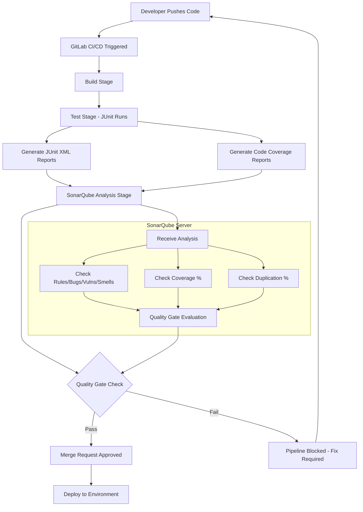
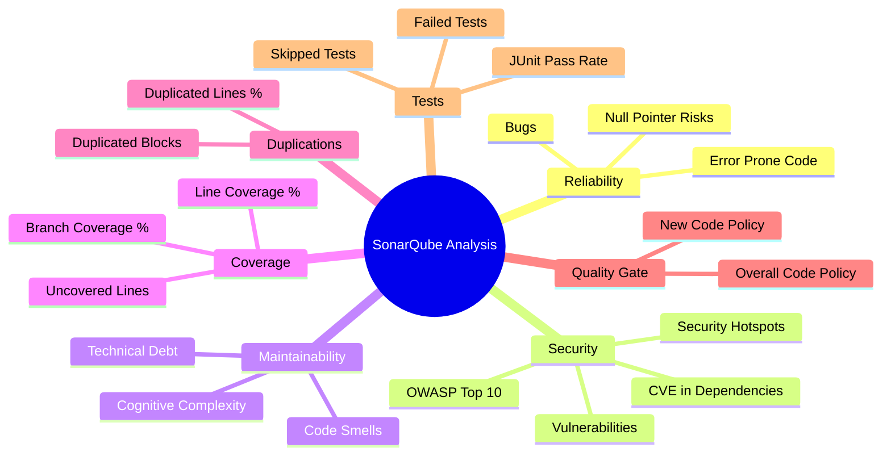

# SonarQube + GitLab + JUnit: End-to-End Guide

## Architecture Overview

```
Developer Push → GitLab CI/CD Pipeline → JUnit Tests Run → SonarQube Analysis → Quality Gate → Merge/Block
```



---

## 1. Core Components Explained

### SonarQube
- A **static code analysis** platform that scans source code for:
  - Bugs, Vulnerabilities, Code Smells, Security Hotspots, Duplications, Coverage
- Has a **Quality Gate** — a pass/fail threshold that can block pipelines

### GitLab CI/CD
- Orchestrates the pipeline via `.gitlab-ci.yml`
- Triggers SonarQube scanner after tests complete
- Can be configured to **fail the pipeline** if Quality Gate fails

### JUnit
- Runs unit/integration tests and produces **XML report files** (`TEST-*.xml`)
- SonarQube reads these XML files to show test results and compute **code coverage**

---

## 2. Prerequisites — Mandatory Checks

### On SonarQube Server
| Item | What to Check |
|---|---|
| Project Key | Unique identifier — must match `sonar.projectKey` in config |
| Authentication Token | Generate from `User > My Account > Security > Generate Token` |
| Quality Gate assigned | Go to `Project > Quality Gate` — assign the correct gate |
| Webhook configured | `Project > Settings > Webhooks` → point to GitLab (for blocking pipelines) |
| Branch/PR Analysis enabled | Requires **Developer Edition** or higher for MR decoration |

### In GitLab
| Item | What to Check |
|---|---|
| `SONAR_HOST_URL` | CI/CD Variable → SonarQube server URL (e.g. `https://sonar.company.com`) |
| `SONAR_TOKEN` | CI/CD Variable → masked & protected token from SonarQube |
| GitLab token for MR decoration | `SONAR_GITLAB_TOKEN` — needed for inline MR comments |
| Runner has network access to SonarQube | Firewall/network rules must allow it |

---

## 3. Project Configuration Files

### `sonar-project.properties` (at project root)
```properties
# Mandatory
sonar.projectKey=my-project-key
sonar.projectName=My Project
sonar.projectVersion=1.0

# Sources
sonar.sources=src
sonar.tests=src/test

# Language
sonar.language=java

# JUnit Test Results (XML path)
sonar.junit.reportPaths=target/surefire-reports

# Code Coverage (JaCoCo for Java)
sonar.coverage.jacoco.xmlReportPaths=target/site/jacoco/jacoco.xml

# Exclusions
sonar.exclusions=**/generated/**,**/*.min.js
sonar.coverage.exclusions=**/*Test.java,**/dto/**
```

### For Python projects
```properties
sonar.projectKey=my-python-project
sonar.sources=src
sonar.tests=tests
sonar.python.coverage.reportPaths=coverage.xml    # from pytest-cov
sonar.python.xunit.reportPath=test-results.xml    # from pytest --junit-xml
```

---

## 4. `.gitlab-ci.yml` — Complete Pipeline Configuration

```yaml
stages:
  - build
  - test
  - sonarqube-analysis
  - quality-gate

variables:
  SONAR_HOST_URL: "$SONAR_HOST_URL"           # Set in GitLab CI/CD Variables
  SONAR_TOKEN: "$SONAR_TOKEN"                 # Set in GitLab CI/CD Variables (masked)

# ── STAGE 1: Build ──────────────────────────────────────────────
build:
  stage: build
  image: maven:3.9-eclipse-temurin-17
  script:
    - mvn clean compile -DskipTests
  artifacts:
    paths:
      - target/

# ── STAGE 2: Test (JUnit + Coverage) ────────────────────────────
test:
  stage: test
  image: maven:3.9-eclipse-temurin-17
  script:
    - mvn test jacoco:report       # JUnit tests + JaCoCo coverage
  artifacts:
    when: always                   # CRITICAL: always upload even on failure
    reports:
      junit: target/surefire-reports/TEST-*.xml   # GitLab native JUnit parsing
    paths:
      - target/surefire-reports/   # JUnit XML for SonarQube
      - target/site/jacoco/        # Coverage XML for SonarQube
    expire_in: 1 week

# ── STAGE 3: SonarQube Analysis ─────────────────────────────────
sonarqube-analysis:
  stage: sonarqube-analysis
  image: sonarsource/sonar-scanner-cli:latest
  dependencies:
    - test                         # Needs JUnit + coverage artifacts
  variables:
    SONAR_USER_HOME: "${CI_PROJECT_DIR}/.sonar"
    GIT_DEPTH: "0"                 # CRITICAL: Full git history for blame info
  cache:
    key: "${CI_JOB_NAME}"
    paths:
      - .sonar/cache
  script:
    - sonar-scanner
        -Dsonar.projectKey=$CI_PROJECT_PATH_SLUG
        -Dsonar.host.url=$SONAR_HOST_URL
        -Dsonar.token=$SONAR_TOKEN
        -Dsonar.sources=src/main
        -Dsonar.tests=src/test
        -Dsonar.junit.reportPaths=target/surefire-reports
        -Dsonar.coverage.jacoco.xmlReportPaths=target/site/jacoco/jacoco.xml
        -Dsonar.gitlab.commit_sha=$CI_COMMIT_SHA
        -Dsonar.gitlab.ref_name=$CI_COMMIT_REF_NAME
        -Dsonar.gitlab.project_id=$CI_PROJECT_ID
  rules:
    - if: '$CI_PIPELINE_SOURCE == "merge_request_event"'   # MR pipelines
    - if: '$CI_COMMIT_BRANCH == "main"'                    # Main branch

# ── STAGE 4: Quality Gate Check ─────────────────────────────────
quality-gate:
  stage: quality-gate
  image: curlimages/curl:latest
  dependencies: []
  script:
    # Poll SonarQube API until Quality Gate result is available
    - |
      STATUS=$(curl -s -u $SONAR_TOKEN: \
        "$SONAR_HOST_URL/api/qualitygates/project_status?projectKey=$CI_PROJECT_PATH_SLUG" \
        | grep -o '"status":"[^"]*"' | head -1 | cut -d'"' -f4)
      echo "Quality Gate Status: $STATUS"
      if [ "$STATUS" != "OK" ]; then
        echo "Quality Gate FAILED. Blocking pipeline."
        exit 1
      fi
  rules:
    - if: '$CI_COMMIT_BRANCH == "main"'
```

---

## 5. JUnit XML Report — What SonarQube Reads

JUnit produces XML like this — SonarQube parses it:

```xml
<?xml version="1.0" encoding="UTF-8"?>
<testsuite name="com.example.UserServiceTest" tests="5" failures="1" errors="0" time="0.123">
    <testcase name="shouldCreateUser" classname="com.example.UserServiceTest" time="0.045"/>
    <testcase name="shouldFailOnNull" classname="com.example.UserServiceTest" time="0.012">
        <failure message="Expected exception not thrown">...</failure>
    </testcase>
</testsuite>
```

SonarQube uses this to display:
- Total tests, passed, failed, skipped
- Test execution time
- Failing test names linked to source code

---

## 6. Mandatory Things to Analyse End-to-End



### Mandatory Metrics to Check

| Category | Metric | Recommended Threshold |
|---|---|---|
| **Reliability** | Bugs | 0 Blocker/Critical bugs |
| **Security** | Vulnerabilities | 0 Critical/High vulnerabilities |
| **Security** | Security Hotspots Reviewed | 100% reviewed |
| **Maintainability** | Code Smells | < defined debt ratio |
| **Coverage** | Line Coverage | >= 80% (new code) |
| **Coverage** | Branch Coverage | >= 70% |
| **Duplications** | Duplicated Lines | < 3% |
| **Tests** | Test Pass Rate | 100% |
| **Quality Gate** | Overall Status | `OK` (not `ERROR` or `WARN`) |

---

## 7. Quality Gate — How It Works

```
New Code Period (last 30 days / since last version)
├── Coverage on New Code >= 80%?        → PASS/FAIL
├── New Bugs = 0?                       → PASS/FAIL
├── New Vulnerabilities = 0?            → PASS/FAIL
├── New Security Hotspots Reviewed?     → PASS/FAIL
└── New Duplication < 3%?               → PASS/FAIL

ALL conditions must PASS → Quality Gate = OK → Pipeline continues
ANY condition FAILS     → Quality Gate = ERROR → Pipeline blocked
```

---

## 8. GitLab MR Decoration (Inline Comments)

When configured properly, SonarQube posts **inline comments on merge requests**:

**Required:**
1. SonarQube **Developer Edition** minimum (Community Edition does NOT support MR decoration)
2. GitLab token with `api` scope stored as `SONAR_GITLAB_TOKEN`
3. In SonarQube: `Administration > DevOps Platform Integrations > GitLab`
4. Set `sonar.gitlab.url`, `sonar.gitlab.userToken`, `sonar.gitlab.projectId`

---

## 9. Common Failure Points & Fixes

| Problem | Root Cause | Fix |
|---|---|---|
| `Quality Gate: No status` | Analysis not finished when gate checked | Add `sonar.qualitygate.wait=true` to scanner args |
| Coverage shows 0% | Wrong report path | Verify `jacoco.xml` path matches `sonar.coverage.jacoco.xmlReportPaths` |
| JUnit results not showing | Artifacts not passed between jobs | Add `dependencies: [test]` in sonar job |
| `SONAR_TOKEN` unauthorized | Token expired or wrong | Regenerate token in SonarQube under user settings |
| Branch not analyzed | `GIT_DEPTH=1` (shallow clone) | Set `GIT_DEPTH: "0"` in CI variables |
| MR decoration not working | Community Edition limitation | Upgrade to Developer Edition |

---

## 10. Key `sonar-scanner` Properties Reference

```bash
# Core
-Dsonar.projectKey=         # Unique project ID in SonarQube
-Dsonar.host.url=           # SonarQube server URL
-Dsonar.token=              # Auth token

# Source paths
-Dsonar.sources=            # Production source folders
-Dsonar.tests=              # Test source folders
-Dsonar.exclusions=         # Files to exclude from analysis

# Test reports
-Dsonar.junit.reportPaths=                        # JUnit XML path
-Dsonar.coverage.jacoco.xmlReportPaths=           # Java coverage
-Dsonar.python.coverage.reportPaths=              # Python coverage
-Dsonar.javascript.lcov.reportPaths=              # JS/TS coverage

# Branch/MR analysis
-Dsonar.branch.name=                              # Current branch
-Dsonar.pullrequest.key=                          # MR IID
-Dsonar.pullrequest.branch=                       # Source branch
-Dsonar.pullrequest.base=                         # Target branch

# Quality Gate
-Dsonar.qualitygate.wait=true                     # Wait & fail pipeline if gate fails
-Dsonar.qualitygate.timeout=300                   # Seconds to wait
```

---

## 11. End-to-End Checklist

```
INFRASTRUCTURE
  [ ] SonarQube server running & accessible from GitLab runner
  [ ] Project created in SonarQube with correct project key
  [ ] Authentication token created & added to GitLab CI/CD variables
  [ ] Quality Gate assigned to project

GITLAB CI PIPELINE
  [ ] .gitlab-ci.yml has test stage that generates JUnit XML
  [ ] Artifacts defined with `when: always` for test results
  [ ] sonarqube-analysis stage has `dependencies: [test]`
  [ ] GIT_DEPTH: "0" set (no shallow clone)
  [ ] sonar.qualitygate.wait=true set to block pipeline on failure

SONAR CONFIGURATION
  [ ] sonar-project.properties exists OR all -D flags passed in CI
  [ ] sonar.sources and sonar.tests paths are correct
  [ ] Coverage report path matches actual generated file location
  [ ] JUnit XML path matches surefire/pytest output location
  [ ] Exclusions defined (generated code, node_modules, etc.)

QUALITY GATE CONDITIONS
  [ ] Coverage threshold defined
  [ ] Zero new bugs rule active
  [ ] Zero new vulnerabilities rule active
  [ ] Security hotspots review required
  [ ] Duplication limit set

MONITORING
  [ ] Pipeline badge showing SonarQube status in GitLab README
  [ ] Team notified on Quality Gate failure (Slack/email webhook)
  [ ] Regular review of technical debt backlog
```

---

> **Most Critical Setting:** `sonar.qualitygate.wait=true` — without it, the pipeline won't block even when code quality fails.


